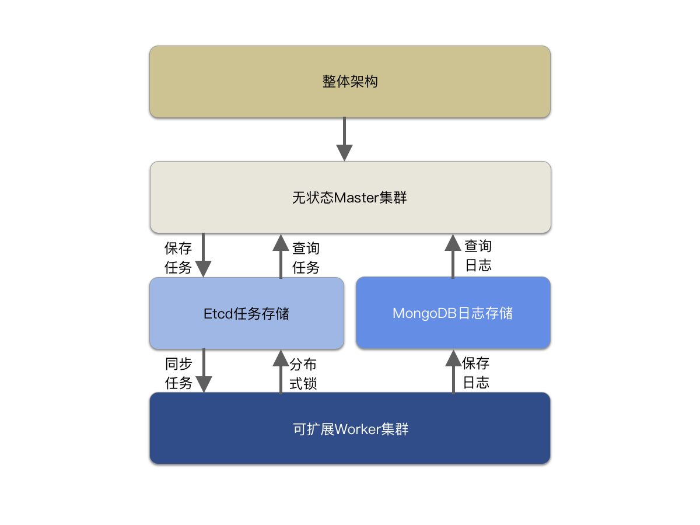

# 项目名称
go_crontab 是一个基于 go 语言开发的分布式定时任务管理系统

## 功能特性
<!-- 描述该项目的核心功能点 -->

## 软件架构（可选）

## 快速开始
### 依赖检查
<!-- 描述该项目的依赖，比如依赖的包、工具或者其他任何依赖项 -->

### 构建
<!-- 描述如何构建该项目 -->

### 运行
<!-- 描述如何运行该项目 -->

## 使用指南
<!-- 描述如何使用该项目 -->

## 如何贡献
<!-- 告诉其他开发者如何给该项目贡献源码 -->

## 社区(可选)
<!-- 如果有需要可以介绍一些社区相关的内容 -->

## 关于作者
atsukodan10@gmail.com

## 谁在用(可选)
如果你有项目在使用该项目，也欢迎联系作者，加入使用案例。

## 许可证
<!-- 这里链接上该项目的开源许可证 -->